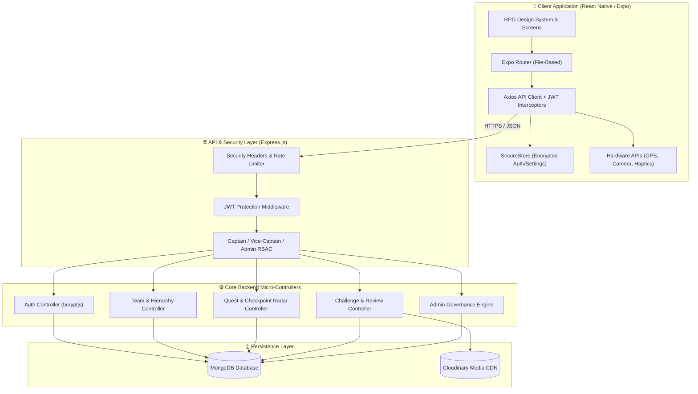
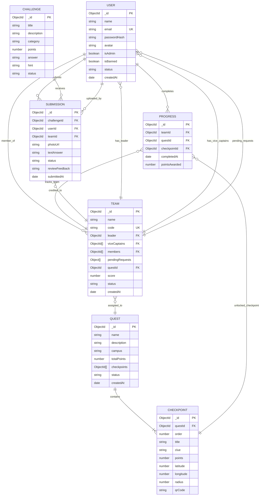
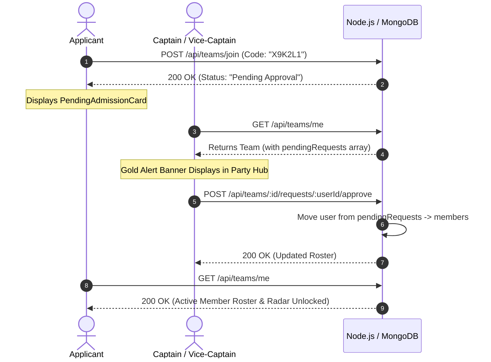
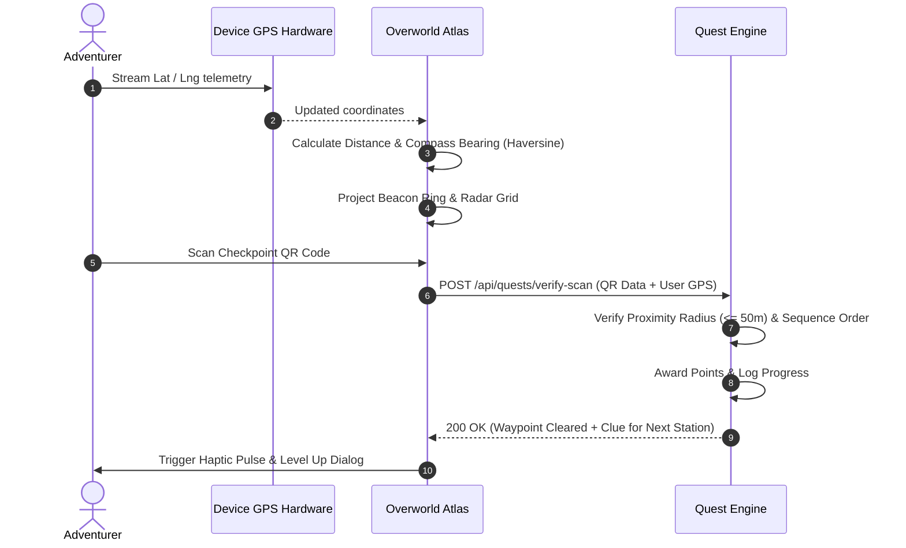

<div align="center">


# 🗺️ Quest-OverWorld

[](https://github.com/rishab11250/Quest-OverWorld/releases/tag/1.0.0)
[](https://documenter.getpostman.com/view/50839472/2sBYAvuAEk)
[](https://github.com/rishab11250/Quest-OverWorld/releases)
<br />


**An immersive, location-based campus exploration and live RPG scavenger quest platform.**  
_Transforming physical environments into dynamic, multiplayer waypoint expeditions._

[Features](#-key-features) • [Architecture](#-system-architecture) • [Database ERD](#-database-entity-relationship-diagram) • [RBAC Matrix](#-role-based-access-control-rbac-matrix) • [Tech Stack](#-technology-stack) • [Env Variables](#-environment-variables) • [Testing](#-development--testing-guide) • [Postman Docs](https://documenter.getpostman.com/view/50839472/2sBYAvuAEk) • [Getting Started](#-getting-started) • [API Reference](#-api-endpoints)

---

</div>

## 🌟 Overview

**Quest-OverWorld** blends real-world GPS navigation, camera-based QR radar scanning, team collaboration, and RPG progression. Adventurers form Guild Parties, track compass bearings to hidden checkpoints, solve multi-disciplinary bounty challenges, and level up their guild perks in real time.

---

## ⚡ Key Features

### 📍 1. Interactive Overworld Atlas & GPS Radar

- **Live Topographical Canvas**: Real-time projection of player position against campus checkpoint waypoints.
- **Dynamic Sonar & Compass Bearing**: Calculates distance (in meters) and cardinal direction arrow using the **Haversine formula**.
- **Sequential Waypoint Gating**: Stations unlock progressively as previous checkpoints are verified.
- **Atmospheric Day/Night Engine**: Tint shifts based on real-time solar hours (Dawn, Day, Dusk, Midnight).
- **Sub-meter High Precision GPS**: Configurable GPS accuracy modes (`Highest` vs `Balanced` battery saver).

### 🛡️ 2. Party & Guild Hierarchy System

- **6-Character Unique Join Code**: Fast invite distribution.
- **Gatekeeper Admission Queue**: Recruits submit entry petitions; Captains and Vice-Captains review, admit (✅), or decline (❌).
- **Three-Tier Command Hierarchy**:
  - 👑 **Captain**: Rename guild, appoint Vice-Captains, transfer leadership, remove members, and gatekeep admissions.
  - 🛡️ **Vice-Captain**: Gatekeeper recruitment approvals and regular member moderation.
  - ⚔️ **Adventurer**: Standard squad member with shared radar telemetry and chat access.
- **Leadership Succession on Leave**: Captains must transfer leadership before stepping down if active teammates remain.
- **Level-Gated Guild Perks (1-5)**: Unlocks telemetry sync, +10% XP multipliers, proximity sonars, and golden crests.
- **Direct SMS Invite**: Pre-addressed native Messages application integration via `expo-linking`.

### ⚔️ 3. Bounty Board & Challenge Engine

- **Multi-Category Quests**: `PHOTO`, `RIDDLE`, `TRIVIA`, and `CREATIVE` challenges.
- **Cloud Proof Verification**: Photo bounty submissions with Cloudinary storage and Admin Review queue.
- **Interactive QR Scanner**: Camera radar featuring laser animation, auto-flashlight activation, and manual passkey fallback.

### 👑 4. Guild Master Console (Admin Dashboard)

- **Live Event Overview**: Real-time player counts, guild rankings, and server health.
- **Player & Guild Governance**: Search, promote/demote admins, ban/unban users, and disqualify guilds.
- **Quest & Checkpoint Studio**: Create quests, place stations with an interactive coordinate map picker, and generate exportable QR codes.
- **Submission Review Queue**: Review player bounty photos, approve rewards, or reject with custom feedback.

### ⚙️ 5. Hero Codex & Preferences

- **Hardware-Wired Preferences**:
  - High-Precision Radar toggle (`expo-location`).
  - Auto-Flashlight trigger (`expo-camera`).
  - Live Guild Polling (15s real-time timer or on-demand fetch).
  - Tactile Haptic Engine mute/unmute (`expo-haptics`).
  - Local GPS cache flusher.
- **Punch-Hole & Notch Safe Area**: Dynamic insets for edge-to-edge Android displays.

---

## 🏗 System Architecture



---

## 🗄️ Database Entity-Relationship Diagram



---

## 🛡️ Role-Based Access Control (RBAC) Matrix

| Capability / Action             | 👑 Admin | 🎖️ Party Captain | 🛡️ Vice-Captain | ⚔️ Party Member | 👤 Guest / Solo |
| :------------------------------ | :------: | :--------------: | :-------------: | :-------------: | :-------------: |
| **View Radar & Active Clues**   |    ✅    |        ✅        |       ✅        |       ✅        |       ❌        |
| **Scan Waypoint QR Codes**      |    ✅    |        ✅        |       ✅        |       ✅        |       ❌        |
| **Submit Bounty Challenges**    |    ✅    |        ✅        |       ✅        |       ✅        |       ❌        |
| **Share SMS Invite Code**       |    ✅    |        ✅        |       ✅        |       ✅        |       ❌        |
| **Admit / Decline Recruits**    |    ✅    |        ✅        |       ✅        |       ❌        |       ❌        |
| **Remove Regular Member**       |    ✅    |        ✅        |       ✅        |       ❌        |       ❌        |
| **Remove Vice-Captain**         |    ✅    |        ✅        |       ❌        |       ❌        |       ❌        |
| **Promote/Demote Vice-Captain** |    ✅    |        ✅        |       ❌        |       ❌        |       ❌        |
| **Rename Guild Party**          |    ✅    |        ✅        |       ❌        |       ❌        |       ❌        |
| **Appoint Successor Captain**   |    ✅    |        ✅        |       ❌        |       ❌        |       ❌        |
| **Disqualify / Ban Guild**      |    ✅    |        ❌        |       ❌        |       ❌        |       ❌        |
| **Ban / Unban Player**          |    ✅    |        ❌        |       ❌        |       ❌        |       ❌        |
| **Create & Edit Quests**        |    ✅    |        ❌        |       ❌        |       ❌        |       ❌        |
| **Review Photo Proofs**         |    ✅    |        ❌        |       ❌        |       ❌        |       ❌        |

---

## 🔄 Data Flow & State Lifecycle

### 1. Party Gatekeeper & Hierarchy Flow



### 2. Waypoint Radar & Checkpoint Discovery Flow



---

## 💻 Technology Stack

### Mobile Client (`/app`)

| Technology                         | Description                                               |
| :--------------------------------- | :-------------------------------------------------------- |
| **React Native (v0.81)**           | Cross-platform native mobile foundation with React 19.    |
| **Expo SDK 54**                    | Managed native tooling, camera, location, secure storage. |
| **Expo Router v4**                 | File-based routing with tab and nested stack navigators.  |
| **expo-camera**                    | Real-time QR code scanning with auto-torch flashlight.    |
| **expo-location**                  | Hardware GPS watcher and reverse geocoding.               |
| **expo-haptics**                   | Tactile vibration engine for button clicks and unlocks.   |
| **expo-secure-store**              | Encrypted keychain/keystore JWT session storage.          |
| **react-native-safe-area-context** | Dynamic insets for punch-hole and camera notch devices.   |

### Backend Engine (`/server`)

| Technology               | Description                                         |
| :----------------------- | :-------------------------------------------------- |
| **Node.js & Express.js** | Modular RESTful API engine.                         |
| **MongoDB & Mongoose 8** | NoSQL database with nested populate & schema hooks. |
| **JWT & bcryptjs**       | Stateless authentication and password hashing.      |
| **Cloudinary & Multer**  | Media CDN storage for photo proof submissions.      |
| **Helmet & CORS**        | HTTP security headers and cross-origin protection.  |

---

## 📁 Project Structure

```
Quest-OverWorld/
├── .github/
│   └── workflows/
│       └── build-apk.yml               # Automated Android APK CI/CD release workflow
├── client/                             # React Native / Expo Frontend
│   ├── app/                            # Expo Router Screen Directory
│   │   ├── (auth)/                     # Login & Registration Screens
│   │   │   ├── login.jsx
│   │   │   └── register.jsx
│   │   ├── (tabs)/                     # Main Navigation Tabs
│   │   │   ├── _layout.jsx             # RPG Tab Bar Configuration
│   │   │   ├── home.jsx                # Quest Overview & Active Clues
│   │   │   ├── map.jsx                 # Overworld Atlas & Waypoint Radar
│   │   │   ├── team.jsx                # Party Hub, Roster & Gatekeeper
│   │   │   ├── challenges.jsx          # Bounty Board (Photo, Riddle, Trivia)
│   │   │   ├── leaderboard.jsx         # Realm Hall of Fame Rankings
│   │   │   └── profile.jsx             # Hero Codex & Functional Preferences
│   │   ├── admin/                      # Guild Master Console (Admin Dashboard)
│   │   │   └── dashboard.jsx
│   │   ├── camera/
│   │   │   └── scanner.jsx             # QR Radar & Scanner Screen
│   │   ├── team/[teamId].jsx           # Party Inspector & Details
│   │   └── _layout.jsx                 # Root Safe Area & Font Loader Layout
│   ├── components/                     # Modular Reusable UI Components
│   │   ├── admin/                      # Admin Tabs, Modals & Map Pickers
│   │   │   ├── modals/                 # Decomposed Admin Dialog Modules
│   │   │   └── map/                    # Location Picker & Radius Projections
│   │   ├── profile/                    # Profile Subcomponents (Hero, Settings, Realm)
│   │   ├── team/                       # Squad Modals (Manage, Gatekeeper, Rename)
│   │   ├── OverworldMap.jsx            # Dynamic Coordinate Canvas & Compass
│   │   ├── RpgTabBar.jsx               # Pixel Gold Trimmed Hotbar
│   │   └── PixelCard.jsx               # Retro Styled Containers
│   ├── lib/                            # Helpers (api, haptics, location, secureStore)
│   └── theme/                          # Colors, Atmosphere, Spacing, Typography
└── server/                             # Node.js / Express Backend
    ├── config/                         # MongoDB & Cloudinary Connection Setup
    ├── controllers/                    # Business Logic Controllers
    │   ├── admin/                      # Player, Guild, Quest & Review Governance
    │   ├── authController.js           # JWT Authentication
    │   ├── teamController.js           # Party Hierarchy & Gatekeeper Queue
    │   ├── questController.js          # Checkpoint Verification & Clue Engine
    │   └── challengeController.js      # Bounty Submissions & Verification
    ├── middleware/                     # JWT Auth & Role Authorization
    ├── models/                         # Mongoose Models (User, Team, Quest, Checkpoint, Progress, Challenge)
    ├── routes/                         # Express Route Definitions
    └── server.js                       # Server Entry Point
```

---

## 🚀 Getting Started

### 📋 Prerequisites

- **Node.js**: `v20.x` or `v24.x`
- **Package Manager**: `pnpm` (recommended) or `npm`
- **Expo Go App** or **Android Studio / Device** (with USB Debugging / ADB)
- **MongoDB Instance** (Local or MongoDB Atlas)

---

### 1. Backend Setup

```bash
# Navigate to server directory
cd server

# Install dependencies
pnpm install

# Create environment configuration
cp .env.example .env
```

Configure your `server/.env` file:

```env
PORT=5000
MONGO_URI=mongodb://localhost:27017/quest_overworld
JWT_SECRET=your_super_secret_jwt_key
CLOUDINARY_CLOUD_NAME=your_cloud_name
CLOUDINARY_API_KEY=your_api_key
CLOUDINARY_API_SECRET=your_api_secret
```

Start the backend server:

```bash
# Development mode with hot-reload
pnpm run dev
```

---

### 2. Mobile App Setup

```bash
# Navigate to client directory
cd ../client

# Install dependencies
pnpm install
```

Configure `client/lib/api.js` with your backend server URL:

```javascript
const BASE_URL = 'http://YOUR_LOCAL_IP:5000/api';
```

Start the Expo Development Server:

```bash
# Start Expo bundler
pnpm start

# Run directly on connected Android device
pnpm android
```

---

### 3. Environment Variables Reference

#### Backend Server (`server/.env`)

| Variable                | Required | Default | Description                                                                              |
| :---------------------- | :------: | :-----: | :--------------------------------------------------------------------------------------- |
| `PORT`                  |    ❌    | `5000`  | Port for the Express.js HTTP API server.                                                 |
| `MONGO_URI`             |    ✅    |    —    | MongoDB connection URI (Local or MongoDB Atlas cluster).                                 |
| `JWT_SECRET`            |    ✅    |    —    | Secret key used for signing and verifying JSON Web Tokens.                               |
| `JWT_EXPIRE`            |    ❌    |  `30d`  | Expiration duration for user session tokens.                                             |
| `CLOUDINARY_CLOUD_NAME` |    ❌    |    —    | Cloudinary cloud identifier for photo bounty uploads.                                    |
| `CLOUDINARY_API_KEY`    |    ❌    |    —    | Cloudinary API access key.                                                               |
| `CLOUDINARY_API_SECRET` |    ❌    |    —    | Cloudinary API secret key.                                                               |
| `BYPASS_GEOFENCE`       |    ❌    | `false` | When set to `true`, bypasses GPS proximity checks during QR scans for local dev testing. |
| `CORS_ORIGIN`           |    ❌    |   `*`   | Allowed CORS origins (comma-separated for production).                                   |

#### Mobile Client (`client/lib/api.js`)

| Setting    | Required |            Example             | Description                                                                  |
| :--------- | :------: | :----------------------------: | :--------------------------------------------------------------------------- |
| `BASE_URL` |    ✅    | `http://192.168.1.15:5000/api` | Target backend REST API endpoint reachable from your physical mobile device. |

---

## 📡 API Endpoints & Payload Specifications

> 🚀 **Interactive Live Documentation:** View, fork, and test all runnable endpoints directly on the [Quest-OverWorld Postman Documenter](https://documenter.getpostman.com/view/50839472/2sBYAvuAEk).

<details>
<summary><b>🔐 1. Authentication Endpoints (Click to expand)</b></summary>

#### `POST /api/auth/register`

- **Request Body:**

```json
{
  "name": "Alex Hunter",
  "email": "alex@overworld.realm",
  "password": "SecurePassword123",
  "avatar": "shield-crown"
}
```

- **Response (201 Created):**

```json
{
  "token": "eyJhbGciOiJIUzI1NiIsInR5cCI6IkpXVCJ9...",
  "user": {
    "_id": "66d3a8e2b1...",
    "name": "Alex Hunter",
    "email": "alex@overworld.realm",
    "avatar": "shield-crown",
    "isAdmin": false
  }
}
```

#### `POST /api/auth/login`

- **Request Body:**

```json
{
  "email": "alex@overworld.realm",
  "password": "SecurePassword123"
}
```

- **Response (200 OK):**

```json
{
  "token": "eyJhbGciOiJIUzI1NiIsInR5cCI6IkpXVCJ9...",
  "user": {
    "_id": "66d3a8e2b1...",
    "name": "Alex Hunter",
    "email": "alex@overworld.realm",
    "avatar": "shield-crown",
    "isAdmin": false
  }
}
```

</details>

<details>
<summary><b>🛡️ 2. Party & Gatekeeper Hierarchy Endpoints (Click to expand)</b></summary>

#### `POST /api/teams/join`

- **Request Body:**

```json
{
  "code": "X9K2L1"
}
```

- **Response (200 OK - Queued for Approval):**

```json
{
  "success": true,
  "pending": true,
  "message": "Admission request sent to \"Shadow Vanguard\". Waiting for Captain or Vice-Captain approval.",
  "pendingTeam": {
    "_id": "66d3b1f0c2...",
    "name": "Shadow Vanguard",
    "code": "X9K2L1"
  }
}
```

#### `POST /api/teams/:id/requests/:userId/approve`

- **Response (200 OK):**

```json
{
  "success": true,
  "message": "Adventurer admitted into the party!",
  "team": {
    "_id": "66d3b1f0c2...",
    "name": "Shadow Vanguard",
    "code": "X9K2L1",
    "score": 450,
    "members": [{ "_id": "66d3a8e2b1...", "name": "Alex Hunter", "email": "alex@overworld.realm" }],
    "viceCaptains": []
  }
}
```

#### `POST /api/teams/:id/transfer-leadership`

- **Request Body:**

```json
{
  "newLeaderId": "66d3a8e2b1..."
}
```

- **Response (200 OK):**

```json
{
  "success": true,
  "message": "Party leadership transferred. You are now Vice-Captain.",
  "team": { ... }
}
```

</details>

<details>
<summary><b>🗺️ 3. Quests & Checkpoint Verification Endpoints (Click to expand)</b></summary>

#### `GET /api/quests/active`

- **Response (200 OK):**

```json
{
  "quest": {
    "_id": "66d3c004e5...",
    "name": "Campus Genesis Odyssey",
    "campus": "North Quad Grounds",
    "totalCheckpoints": 4,
    "currentOrder": 2,
    "isCompleted": false,
    "currentClue": {
      "_id": "66d3c110f6...",
      "order": 2,
      "title": "Clocktower Plaza",
      "clue": "Under the ancient bell that tolls the ninth hour, find the stone monolith.",
      "points": 150,
      "radius": 50
    },
    "completedCheckpoints": [
      { "_id": "66d3c050a1...", "order": 1, "title": "North Quad Fountain", "completed": true }
    ],
    "checkpoints": [ ... ]
  },
  "team": {
    "_id": "66d3b1f0c2...",
    "name": "Shadow Vanguard",
    "score": 450
  }
}
```

#### `POST /api/checkpoints/verify`

- **Request Body:**

```json
{
  "qrCode": "CHECKPOINT_GENESIS_2_CLK",
  "latitude": 12.9716,
  "longitude": 77.5946
}
```

- **Response (200 OK):**

```json
{
  "success": true,
  "message": "🎉 Checkpoint #2 (Clocktower Plaza) successfully cleared!",
  "pointsAwarded": 165,
  "bonusXp": 15,
  "appliedMultiplier": 1.1,
  "guildLevel": 2,
  "totalScore": 465,
  "clearedCheckpoint": {
    "_id": "66d3c110f6...",
    "title": "Clocktower Plaza",
    "order": 2
  },
  "nextClue": {
    "_id": "66d3c220a3...",
    "order": 3,
    "title": "Observatory Hill",
    "clue": "Where astronomers track distant constellations.",
    "points": 200,
    "radius": 50
  },
  "isQuestCompleted": false
}
```

</details>

<details>
<summary><b>⚔️ 4. Bounties & Submission Endpoints (Click to expand)</b></summary>

#### `POST /api/challenges/:id/submit`

- **Request Body (Multipart Form-Data or JSON):**

```json
{
  "textAnswer": "The bronze sundial near the library.",
  "photoUrl": "https://res.cloudinary.com/quest/image/upload/v12345/proof.jpg"
}
```

- **Response (200 OK):**

```json
{
  "success": true,
  "message": "Bounty proof submitted for Guild Master review!"
}
```

</details>

---

## 📦 Building Android Release APK

Quest-OverWorld includes an automated GitHub Actions pipeline.

To build a new production APK:

```bash
# Tag a release commit
git tag -a 1.0.0 -m "Release v1.0.0"

# Push tag to GitHub
git push origin 1.0.0
```

_The `.github/workflows/build-apk.yml` workflow automatically compiles the standalone Android APK and attaches the asset directly to your [GitHub Releases](https://github.com/rishab11250/Quest-OverWorld/releases) page._

---

## 👨‍💻 Created By

<div align="center">

Crafted with passion, precision, and ⚔️ by **[Rishab](https://github.com/rishab11250)**.

[](https://github.com/rishab11250)

</div>

---

<div align="center">

### ✨ Thank You! ✨

_Thank you for exploring and supporting **Quest-OverWorld**! If you enjoyed this project or found it helpful, consider leaving a ⭐ on [GitHub](https://github.com/rishab11250/Quest-OverWorld)._

<sub>Happy Adventuring & Scavenger Questing across the Overworld! 🗺️⚔️🛡️</sub>

</div>
